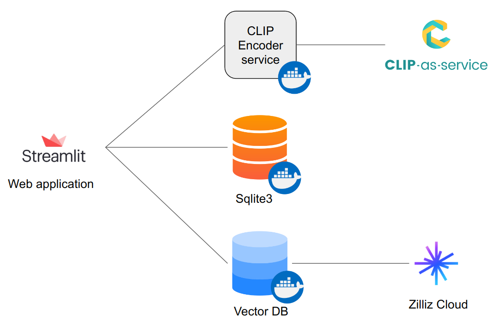
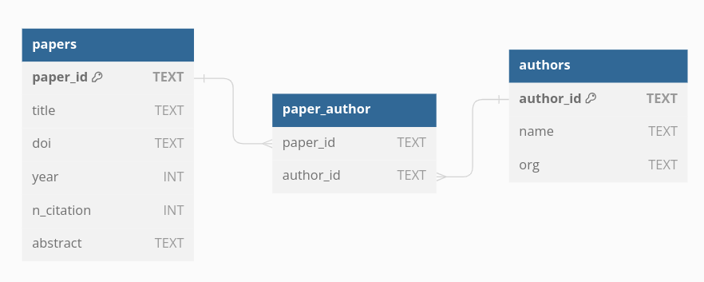

# ExpertSeek

## Features

* Search experts by name, organization and keywords (reseach topics, method names, etc.)
* Find top co-authors of an expert
* Find top relevant experts of an expert

## Dataset

I utilized the [DBLP-Citation-network V14](https://originalfileserver.aminer.cn/misc/dblp_v14.tar.gz) dataset which includes $5,259,858$ papers, the information of a paper looks like this:

```json
{
	"id": "6373113490e50fcafd4bac6c",
	"title": "Beach Profile ...",
	"doi": "10.3390/rs14194968",
	"issue": "19",
	"lang": "en",
	"venue": {"raw": "REMOTE SENSING"},
    "keywords": ["embedded systems", " terrestrial LiDAR", " rapid response"],
	"year": 2022,
	"n_citation": 0,
	"page_start": "",
	"page_end": "",
	"volume": "14",
	"issn": "2072-4292",
	"isbn": "",
	"url": ["http://www.webofknowledge.com/"],
	"abstract": "A prototype rapidly ...",
	"authors": [{"id": "", "name": "Christopher S. O'Connor", "org": "Univ N Carolina"}],
    "doc_type": "Journal"}
}
```

Since the number is quite large for my computational resources, I filtered and used a subset of papers that:

- Were published from 2010 to the present
- Have a non-empty abstract
- Are written in English
- Belong to the top 300 authors with the most papers.

Thus, I obtained a dataset of $55,996$ papers belonging to $53,211$ authors.

## System design



### Sqlite3



A SQL database to store and query all necessary information such as:

* Search experts by name or organization
* List co-authors of an expert
* Get information of experts, papers

### CLIP Encoder

This service takes on the role of encoding text input into an embedding vector:

* In the preprocessing stage, the service encodes the abstract of all papers. Then, the embedding vectors of paper abstracts were stored and indexed in a **Vector Database**.
* During application operation, this service encodes the text query from users into an embedding, which will be used to search on the vector database.

For the text embedding task, I utilized [Clip-as-service](https://clip-as-service.jina.ai/#), a free and open API having the `ViT-L-14-336::openai` model.

### Vector database

This service includes 2 collections:

* Paper embedding database: Store embedding vectors of all papers. The embeddings were computed by the **CLIP Encoder** service above, given the paper abstracts.
* Author embedding database: Store embedding vectors of all authors. The authors' embedding vectors are simply the average of the embeddings of the papers they contributed to

The vector database serves 2 use cases:

* **Find experts by a text query**: The text query is encoded by the **CLIP Encoder**, then the authors with the nearest (L2 distance) embeddings are retrieved.
* **Find relevant experts**: From one expert, the system retrieves the nearest neighbors (L2 distance) based on the embedding vectors.

### Web application

I developed the client side using StreamLit to quickly demonstrate the system.